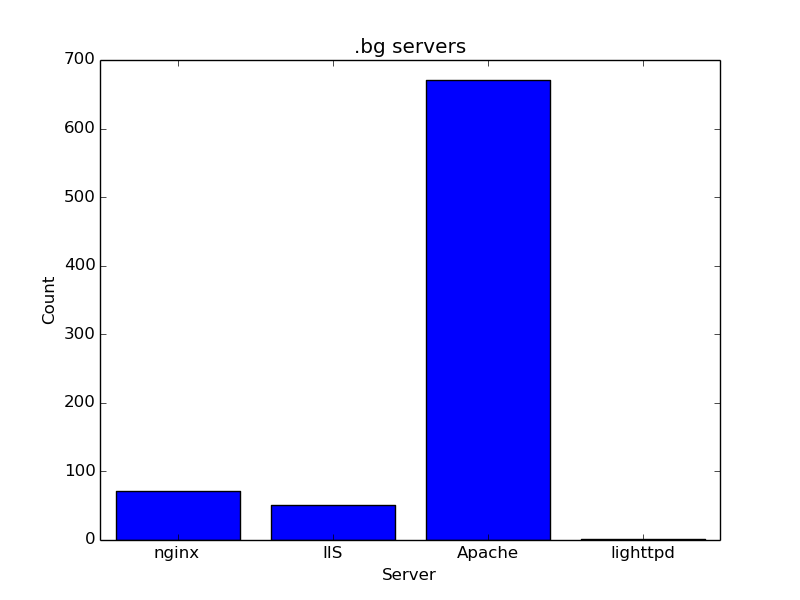

# Crawl the bulgarian web!

We are goint to make a histogram of the server software that runs bulgarian webpages (that end in .bg)

## Crawling vs. API

We are going to distinguish making **HTTP calls to an API** and **crawling websites**!

API means that there is a way to get information in a nicely-structured way. Most of the APIs return JSON data.

For example, GitHub gives us an API: https://api.github.com/users/radorado, which returns JSON. JSON is good because we can easily parse it into data-structures.

But most of the websites do not provide any API. So we have to work for our information - parsing the HTML structure of the websites. **This is called crawling**

## What serves that website?

In order to understand what is the server, running given web site, we need to make HTTP request (for example GET), and see the response headers.

**There is a `Server` header which holds a string with the information.**

For example:

```
$ curl -I https://hackbulgaria.com 
HTTP/1.1 200 OK
Server: nginx/1.6.2
Date: Sat, 25 Apr 2015 21:05:43 GMT
Content-Type: text/html; charset=utf-8
Connection: keep-alive
Vary: Accept-Encoding
X-Frame-Options: SAMEORIGIN
Vary: Cookie
Strict-Transport-Security: max-age=31536000
X-Content-Type-Options: nosniff
X-Frame-Options:: deny
```

As you can see, the `Server: nginx/1.6.2` header gives us the information that `hackbulgaria.com` runs `nginx`.

That's great.

How about Python?

```python
>>> import requests
>>> r = requests.get("https://hackbulgaria.com")
>>> print(r.headers["Server"])
'nginx/1.6.2'
```

Easy as a pie!

## Crawling & Information

Now, if we want to crawl all websites (or almost all websites) that end in .bg, we are going to need a list of them.

We can a big list, around 10 000 pages, from here - http://register.start.bg/

The catch is - there is no API. We will have to crawl our information. **Find all links in the HTML of the page.**

Our hint here is - use [BeautifulSoup](http://www.crummy.com/software/BeautifulSoup/) in order to parse the HTML of the page into more meaningful structures.

Check the structure of the website. There are links that look like `link.php?id=64722`. They are the key to solve that problem. Play with them - see what you can do.

## Histogram of the results

While you crawl all the 10 000 pages, create a histogram of the different web servers that run them.

When you are done, save the result in a file.

You are going to have results which look like that:

```
...
Apache/2.4.7 (Unix) PHP/5.4.25: 1
Apache/2.4.7 (Win64) OpenSSL/1.0.1g mod_fcgid/2.3.9: 1
Apache/2.4.9 (Unix) OpenSSL/1.0.1e-fips mod_bwlimited/1.4: 1
Apache/2: 7
Apache: 384
Apache-Coyote/1.1: 1
Apache mod_fcgid/2.3.7 mod_auth_pgsql/2.0.3: 2
Apashi 1.1 mod_fcgid/2.3.5: 1
cloudflare-nginx: 5
Host.bg redirect server based on Apache/1.3.31 (Unix): 2
IBM_HTTP_Server: 2
lighttpd/1.4.22: 1
Microsoft-IIS/5.0: 5
Microsoft-IIS/6.0: 15
Microsoft-IIS/7.0: 3
Microsoft-IIS/7.5: 23
Microsoft-IIS/8.0: 2
Microsoft-IIS/8.5: 3
nginx/0.7.62: 1
nginx/0.7.65: 1
nginx/0.7.67: 1
nginx/0.8.53: 1
nginx/1.0.10: 3
...
```

## Consolidate Results & Plot Them

As you can see, there are a lot of different versions of Apache or nginx or IIS. If we want to make a more general analysis, we are going to consolidate all Apache results into a single "Apache" entity.

Do so and plot the resulted histogram in a histogram chart that looks something like that:




You can use [matplotlib](http://matplotlib.org/) for ploting.

## Extra Credit

Think about the design of the problem. Can you split the problem in smaller parts / systems?

After you are done, make a simple **Flask** HTTP serves, that handles one URL:

```
GET /results
```

This should return the resulting histogram, so far, in a JSON format.

After this, you can hook the plotter to this server.

## Hints

Read this only if you have done most of the problem.

## SQLAlchemy

Use it. It will make your life easier.

### User Agent

If you send request from python's `requests` it looks like that:

```
GET / HTTP/1.1
Host: localhost:8000
User-Agent: python-requests/2.3.0 CPython/3.4.2 Linux/3.16.0-34-generic
Accept-Encoding: gzip, deflate
Accept: */*
```

As you can see, the `User-Agent` header says python-requests. This is not good.

If we want to send a request that looks like google chrome, we can check here - http://www.useragentstring.com/pages/Chrome/

In order to do this, we will use the `headers=` keyword for `requests.get`

```python
our_headers = {
 "User-Agent": "Mozilla/5.0 (Windows NT 6.1) AppleWebKit/537.36 (KHTML, like Gecko) Chrome/41.0.2228.0 Safari/537.36"
}

requests.get("http://localhost:8000", headers=our_headers)
```

This will look like a Google Chrome request, which is good when we are crawling.

### HEAD instead of GET

When we make a `GET` request, we download the entire HTML. This can be slow, especially on slow internet connections.

There is another HTTP verb that we can use. It is called `HEAD`.

This request asks only for the server headers and not for the content - exactly what we need.

Read the [requests documentation](http://docs.python-requests.org/en/latest/user/quickstart/) to see how to make a `HEAD` request.

### Ploting from dictionary

When you are ready and you have a dictionary with results, you can plot the histogram like that: (it is ugly!)

```python
from hist import Histogram
import matplotlib.pyplot as plt

h = Histogram()

# .. results ..

h = h.get_dict()
keys = list(h.keys())
values = list(h.values())

X = list(range(len(keys))) 

plt.bar(X, list(h.values()), align="center")
plt.xticks(X, keys)

plt.title(".bg servers")
plt.xlabel("Server")
plt.ylabel("Count")

plt.savefig("histogram.png")
```

